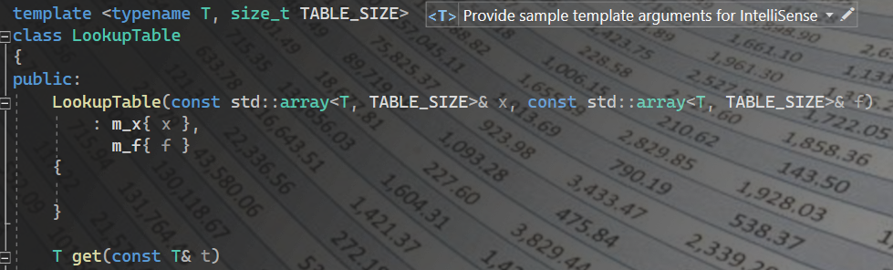

# Fast and Efficient C++ Lookup Table class

LookupTable.h provides a template class for creating lookup tables. The class features a linear interpolation algorithm that uses branchless binary search to find the indices used in the interpolation.
